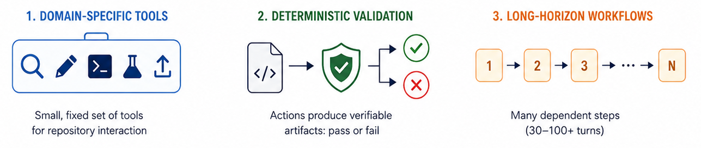

# Scaffold Inconsistency Issue in Code Agent Training

UbiCloud

---

# Overview

On [SWE-Bench Verified](https://www.swebench.com/), the same SFT-fine-tuned model resolves between 2 and 112 instances depending solely on which agent scaffold mediates its interaction with the repository:

| | Best Scaffold | Worst Scaffold |
|---|:---:|:---:|
| Resolve Rate | **22.4%** | 0.4% |
| Instances Resolved | 112 / 500 | 2 / 500 |

This is the **scaffold inconsistency problem**: SFT binds the model to the exact tool names and action syntax it saw during training (format-lock), so switching scaffolds silently drops tool calls, abandons file editing, or traps the model in error loops. The union of all five scaffolds resolves 175 instances (35.0%), 1.56× the best single scaffold, meaning any single evaluation may underestimate model capability.

🔗 **Models:** [SWE-Qwen3-14B](https://huggingface.co/ubicloud/SWE-Qwen3-14B) | **Data:** [SWE-Openhands-Devstral-32k-20K](https://huggingface.co/datasets/ubicloud/filtered-SWE-Openhands-Devstral-32k-20K)

# Background

A **code agent scaffold** is the execution environment that mediates between a language model and a software repository. Unlike general-purpose agent frameworks, code agent scaffolds are specifically designed for **software engineering workflows** [1], such as navigating repositories, editing files, running tests, and submitting patches.

In practice, a scaffold consists of three tightly coupled components:

- **System prompts** that instruct the model on behavior, output format, and workflow.
- **Tool interfaces** that determine available actions (e.g., search, edit, execute, submit).
- **Interaction strategies** that govern the loop structure and constraints (e.g., ReAct [2], CodeAct [3], step limits, context windows).

These components directly shape training trajectories, meaning the scaffold defines **what the model learns to do**, not just what data it learns from.

  
**Figure 1:** Key characteristics of code agent tasks.

Code scaffolds differ from general agent frameworks in several key ways:

- **Domain-specific tool sets.** Code scaffolds provide a small, fixed set of tools optimized for repository interaction. The model must learn to compose them effectively within strict step budgets.
- **Deterministic validation.** Code agent actions produce verifiable artifacts: patches that either pass or fail test suites. This makes evaluation reproducible but tightly couples performance to scaffold-specific formatting and submission conventions.
- **Long-horizon workflows.** Code agents typically require 30-100+ interaction turns per task, each dependent on prior observations. Models trained under one interaction strategy may develop habits incompatible with another.

A model trained on trajectories collected under one scaffold may perform poorly when evaluated under another. We refer to this as the **scaffold inconsistency problem**, which is the central focus of this report. To study it rigorously, we need a controlled setup where training data is held constant while evaluation scaffolds vary.

# Open-sourced Data Filtering and Selection

**Why not collect our own trajectories?** Gathering 20K resolved trajectories (~40K attempts at ~50% resolve rate) produces ~26B input and ~1.1B output tokens due to context accumulation across turns; even with prompt caching (~70% cache hit rate), estimated API costs range from ~$4K (DeepSeek-V4-Pro) to ~$81K (GPT-5.5). Repeating this process for each agent scaffold would result in substantial resource waste, so we use identical open-sourced data across all scaffolds in our experiments.

Specifically, we use [SWE-Star](https://huggingface.co/datasets/LogicStar/SWE-Star), a 250K+ sample dataset collected under a **modified OpenHands** scaffold. We intentionally select a single-source dataset so that all training trajectories share a uniform scaffold, isolating the scaffold inconsistency effect in training. This also reflects a broader reality: most high-quality open-source agent SFT datasets available today are derived from OpenHands (often with modifications), making our setup representative of the constraints faced by many practitioners. 

## Data Filtering

To enable training under limited resources, we design a data pipeline with 10 hard filtering rules, organized by the specific behavioral issues they target.

**Structural validity.** We reject trajectories with zero edits, fewer than 3 assistant turns, missing or excessively short system prompts (<100 chars), or empty assistant messages. These are not quality judgments but **basic data integrity checks**: broken records introduce noise rather than signal during SFT.

**Exploration before action.** We require at least one view or search operation before the first edit, and cap reproduction-script edits at 50% of all edits. Small models have limited step budgets and must learn to **understand before modifying**; trajectories that edit blindly or spend most turns on diagnostic scripts teach poor resource allocation.

**Edit grounding.** We compute a composite **edit integrity score** (0-1) penalizing blind edits (editing unread files), weak anchors (`old_str` too short relative to `new_str`), and undefined references (using names never seen in context). Trajectories scoring below 0.3 are rejected, as are those with ≥3 consecutive edit-then-error cycles. Small models are prone to imitating surface patterns; these rules ensure they only see edits **anchored in observed repository state**.

**Verification and efficiency.** We require at least one test or verification command after the final edit, and reject trajectories with ≥3 consecutive identical command repetitions. In a limited-step setting, every wasted turn reduces success probability; these rules ensure the model learns to **verify its work and avoid repetitive loops**.

## Data Selection

After filtering, we score and rank the remaining trajectories to select **20K** samples for SFT. The selection strategy is **quality-first with diversity as a soft constraint**: trajectories are ranked by a weighted composite score, then greedily selected while penalizing over-representation along three axes (repository, tool pattern, step-count bucket).

The composite score consists of eight weighted dimensions. The two highest-weighted dimensions reflect our core priorities:

- **Ideal trajectory (weight 0.22).** Rewards trajectories where most tool calls are productive actions (view, edit, test) rather than exploratory noise, and where the agent reaches a clean submit. This dimension captures the overall **signal-to-noise ratio** of the trajectory. A high score means the agent spent its step budget on actions directly contributing to the fix, rather than wandering through the repository.

- **Fix quality (weight 0.20).** Rewards modifying existing source files over creating new ones (the correct behavior for bug fixing), requires each edit to be followed by a test within a few steps (preventing batch-edit-without-verify patterns), and rewards final verification with multiple test targets. Trajectories that create new files as workarounds or submit without thorough testing are penalized. This dimension directly targets **whether the model will learn a sound fix workflow**.

The remaining six dimensions provide complementary signals:

| Dimension | Weight | Purpose |
|---|:---:|---|
| Uniqueness | 0.12 | Prefers rare instances; caps each at 5 trajectories |
| Token preference | 0.08 | Favors 8K-32K tokens; extremes waste or lack signal |
| Turn preference | 0.08 | Favors 10-100 turns; same rationale as token preference |
| Repetition penalty | 0.10 | Penalizes consecutive identical commands and low diversity |
| Edit pattern | 0.10 | Rewards even edit distribution throughout the trajectory |
| Read before edit | 0.10 | Rewards edits preceded by views; penalizes excessive reading |

The selection proceeds in two passes: a feature-extraction pass that scores all filtered records, followed by a greedy pass that selects 20K from a 3x buffer (60K candidates) while applying diversity penalties to prevent any single repository, tool pattern, or step-count bucket from dominating the final dataset.

# Training Recipe

We fine-tune **Qwen3-14B** on the filtered 20K trajectories using **LoRA**. The relatively high rank and moderate dropout balance adaptation capacity against overfitting on this mid-sized dataset: too low a rank would under-utilize the data, while too low dropout risks memorizing scaffold-specific formatting patterns.

**Context length and history truncation.** We use a maximum context length of 32,768 tokens. Since many agent trajectories exceed this limit, we enable **history truncation** with a keep fraction of 0.5: when a trajectory exceeds the window, the oldest turns are dropped while preserving the most recent 50%. This ensures the model always sees the most relevant context (recent edits, test results, error messages) rather than losing the tail end, which typically contains the final fix and submission.

**Training details.** Training runs on 2x H200 GPUs with FSDP2 and gradient checkpointing. We train for 2 epochs (1,250 total steps at ~165s/step). Training loss converges from 0.65 to 0.14 with steady improvement and no signs of instability.

| Item | Value |
|------|-------|
| Base Model | Qwen3-14B |
| PEFT | LoRA (rank=32, alpha=64, dropout=0.1) |
| Target Modules | All linear layers |
| Training Data | 20K filtered SWE-Star trajectories |
| Max Context | 32,768 tokens |
| Epochs | 2 (1,250 steps) |
| Batch Size | 16 (micro=1/GPU, grad_accum=8) |
| Learning Rate | 1e-4, cosine, warmup 5% |
| History Truncation | keep_fraction=0.5 |
| Hardware | 2× GPU (FSDP2) |

# Agent Scaffold Inconsistency Issue

## Scaffold Inconsistency

The training trajectories were collected by **Devstral-small-2** (teacher) running on the **SWE-Star (UAC)** scaffold, an OpenHands-like framework using 4 tools (`execute_bash`, `str_replace_editor`, `think`, `finish`) with XML-formatted actions (`<function=tool_name><parameter=name>value</parameter></function>`). Through SFT distillation, the student model has learned to reproduce these exact tool names, parameter names, and action syntax, not just problem-solving strategies.

We evaluate across five scaffolds, named by **source-variant** convention (e.g., `rllm/SWE-Agent` = the SWE-Agent variant from the rllm project):

| Scaffold | Action Format | File Editor | Shell Param | Think Tool | Match to Training |
|----------|:---:|:---:|:---:|:---:|:---:|
| **R2E-Gym/Openhands** | XML | `str_replace_editor` | `command` | ✓ | Exact |
| **rllm/SWE-Agent** | XML | `str_replace_editor` | `command` | ✓ | Exact |
| **rllm/r2egym** | XML | `file_editor` | `cmd` | No | Renamed |
| **R2E-Gym/r2egym** | XML | `file_editor` | `cmd` | No | Renamed |
| **OpenHands-0.54.0** | Text-parsing | bash-only | N/A | ✓ | Format mismatch |

Two scaffolds share the exact tool interface with training; two use renamed tools in the same XML format; one replaces the entire action paradigm with text-parsing. Notably, OpenHands-0.54.0 is the upstream framework version on which the training scaffold (SWE-Star/UAC) was built. However, we select the `bash-only` variant because its action interface differs most substantially from the training scaffold, thereby maximizing scaffold inconsistency. 

## Evaluation Results

We evaluate on the R2E-Gym/SWE-Bench Verified test split (500 instances). We applied minor adaptations to several scaffolds to ensure the model could operate at all; the observed gaps thus represent a lower bound on the true inconsistency effect. Even so, the same model resolves between **2 and 112 instances** depending solely on the scaffold, with scaffold choice being the dominant factor.

| | R2E-Gym/Openhands | rllm/SWE-Agent | rllm/r2egym | OpenHands-0.54.0 | R2E-Gym/r2egym |
|---|:---:|:---:|:---:|:---:|:---:|
| **Resolved** | **112** | 85 | 79 | 22 | 2 |
| **Resolve Rate** | **22.4%** | 17.0% | 15.8% | 4.4% | 0.4% |
| **Mean Steps** | 92.9 | 40.6 | 62.4 | 51.4 | 98.9 |

The union of all scaffolds resolves **175 instances (35.0%)**, 1.56× the best single scaffold. No single scaffold captures more than 64% of the union.

### Root Cause: Tool Name Matching Determines Performance

The resolve rates map directly onto the three tiers of tool interface compatibility:

| Compatibility Tier | Scaffold(s) | Tool Names | Parameters | Format | Resolve Rate |
|---|---|:---:|:---:|:---:|:---:|
| Exact match | R2E-Gym/Openhands | ✓ | ✓ | ✓ | **22.4%** |
| Exact match | rllm/SWE-Agent | ✓ | ✓ | ✓ | **17.0%** |
| Renamed tools | rllm/r2egym | ✗ | ✗ | ✓ | 15.8% |
| Renamed tools | R2E-Gym/r2egym | ✗ | ✗ | ✓ | 0.4% |
| Format mismatch | OpenHands-0.54.0 | ✗ | N/A | ✗ | 4.4% |

SFT distillation creates **format-lock**: the model memorizes the exact syntax of tool invocations alongside problem-solving strategies. When the evaluation scaffold expects different tool names or a different action format, the model's learned behaviors cannot be expressed. This relationship is confirmed by tool-call mismatch rates. Exact-match scaffolds show near-zero mismatch (0.05–0.3%) and achieve 17.0–22.4% resolve rate; rllm/r2egym, with 14.9% tool-name mismatch, drops to 15.8%; OpenHands-0.54.0, with 63.9% empty generation, drops to 4.4%.

### Per-Scaffold Analysis

**R2E-Gym/Openhands (22.4%)** is essentially a re-implementation of the training scaffold, with the same tool names, parameters, and XML format. The model directly reproduces its learned action sequences across 46,348 tool calls with only 0.3% mismatch (minor typos), adopting an exhaustive exploration strategy (mean 92.9 steps, 75.6% hitting the 100-step limit) that maximizes resolve rate at higher compute cost.

**rllm/SWE-Agent (17.0%)** matches the training scaffold's tool interface exactly but differs in prompt structure and observation formatting. Across 19,717 tool calls, only 9 (0.05%) were mismatched. The model adapts efficiently (mean 40.6 steps, only 1.4% hitting the limit), producing concise action sequences when context deviates from training patterns. The 5.4% gap from R2E-Gym/Openhands reflects these secondary differences.

**rllm/r2egym (15.8%)** uses renamed tools: the model generates `<function=str_replace_editor>` but the scaffold expects `<function=file_editor>`. Across 30,808 tool calls, 14.9% (4,604) hit a tool-name mismatch. When this occurs, the scaffold returns an empty observation rather than an error, giving no signal to self-correct; approximately 17,700 invocations (~19%) were silently dropped, including file views, edits, and file creations. The causal impact is clear: instances without mismatches resolved at 21.5%, while those with mismatches resolved at only 7.1%, a 3-fold penalty directly attributable to mismatch. Despite this, `execute_bash` remains functional (the scaffold silently accepts `command` in place of `cmd`), so the model can partially compensate through bash-heavy strategies.

**OpenHands-0.54.0 (4.4%)** warrants particular attention. Despite being the "same framework" used during training, it achieves only 4.4%, a 5-fold drop from R2E-Gym/Openhands. The model's learned habit of writing verbose multi-phase analysis before each tool call consumes output tokens, and the scaffold's 16,384-token output limit frequently truncates responses. The resulting malformed tool calls produce 63.9% empty generations overall and trigger `AgentStuckInLoopError` in 83.6% of instances, as the model enters a truncation–error–retry loop from which it cannot recover. This case demonstrates that surface-level framework identity is insufficient; the exact action interface is what determines transferability.

**R2E-Gym/r2egym (0.4%)** has the same tool name mismatches as rllm/r2egym but additionally lacks the `think` tool. Rather than substituting alternatives, the model stops generating calls to both `str_replace_editor` and `think` entirely, collapsing to `execute_bash` for 95% of all actions. It also produces occasional hallucinated tool names (`execute_bacs`, `editor`, `view`) that exist neither in training nor in the scaffold. These are distortions of tool names the model "knows" but cannot correctly recall. Combined with explicit parameter errors (55% of trajectories call `execute_bash` with `<parameter=command>` instead of `<parameter=cmd>`), the scaffold resolves only 2 of 500 instances, with 97.4% of trajectories hitting the 100-step limit.

# Future Work

The scaffold inconsistency problem points to several open directions. **Scaffold-agnostic training**: normalizing tool names across scaffolds or training with multiple scaffold formats simultaneously may produce models that generalize across evaluation environments. **Multi-scaffold evaluation** should become standard reporting practice: as our results show, a single resolve-rate number is uninformative without scaffold context, and the union across scaffolds is a more reliable measure of model capability. Finally, the format-lock effect raises a broader question for the agent SFT community: whether the current practice of collecting trajectories under a single scaffold and evaluating under another is sound, or whether the ecosystem needs a standardized tool interface specification, analogous to an API contract, that decouples what the model learns from which scaffold it operates under.

# Conclusion

We train Qwen3-14B via SFT on 20K filtered trajectories from the SWE-Star dataset and evaluate across five agent scaffolds. The results reveal a resolve-rate range of 0.4% to 22.4% across scaffolds, with scaffold choice being the dominant factor. The key determinant is tool interface compatibility: scaffolds that match the training scaffold's tool names, parameter names, and action format achieve 17.0-22.4%, while mismatches cause silent failures, tool abandonment, or format-level breakdowns that drop performance to as low as 0.4%. These findings indicate that SFT distillation creates format-lock, and that single-scaffold evaluation may misrepresent model capability. We recommend multi-scaffold evaluation as standard practice and call for community efforts toward standardized tool interfaces.

# References

[1] Jimenez, Carlos E., et al. "SWE-bench: Can language models resolve real-world GitHub issues?" ICLR, 2024.

[2] Yao, Shunyu, et al. "ReAct: Synergizing reasoning and acting in language models." arXiv preprint arXiv:2210.03629, 2022.

[3] Wang, Xingyao, et al. "Openhands: An open platform for ai software developers as generalist agents." ICLR, 2025.
