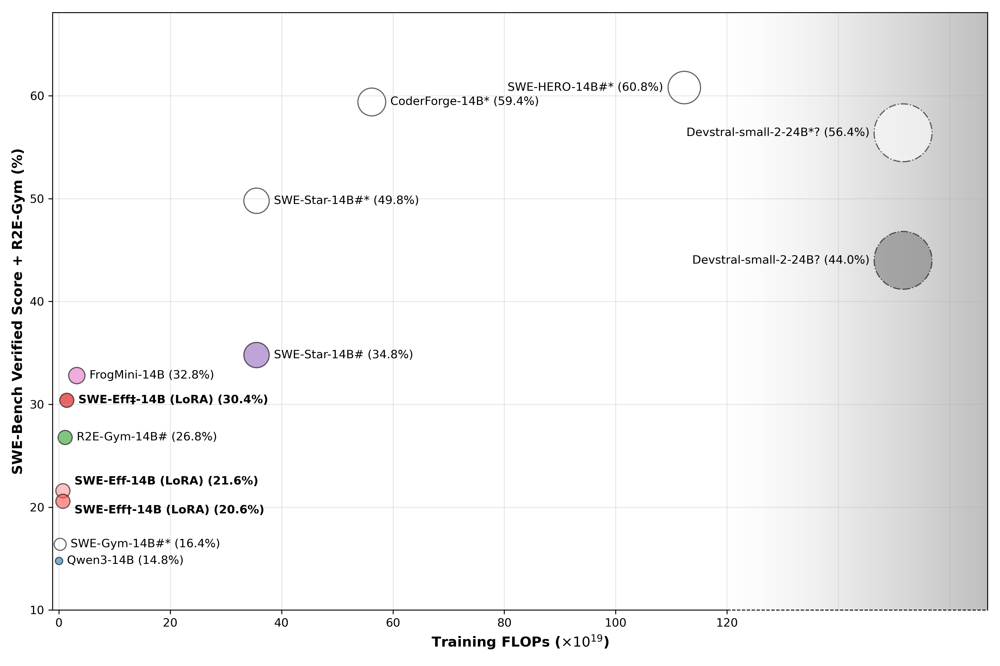
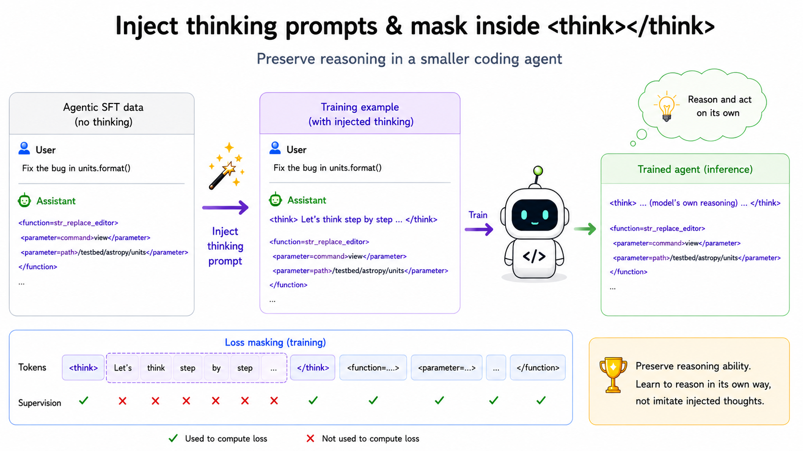
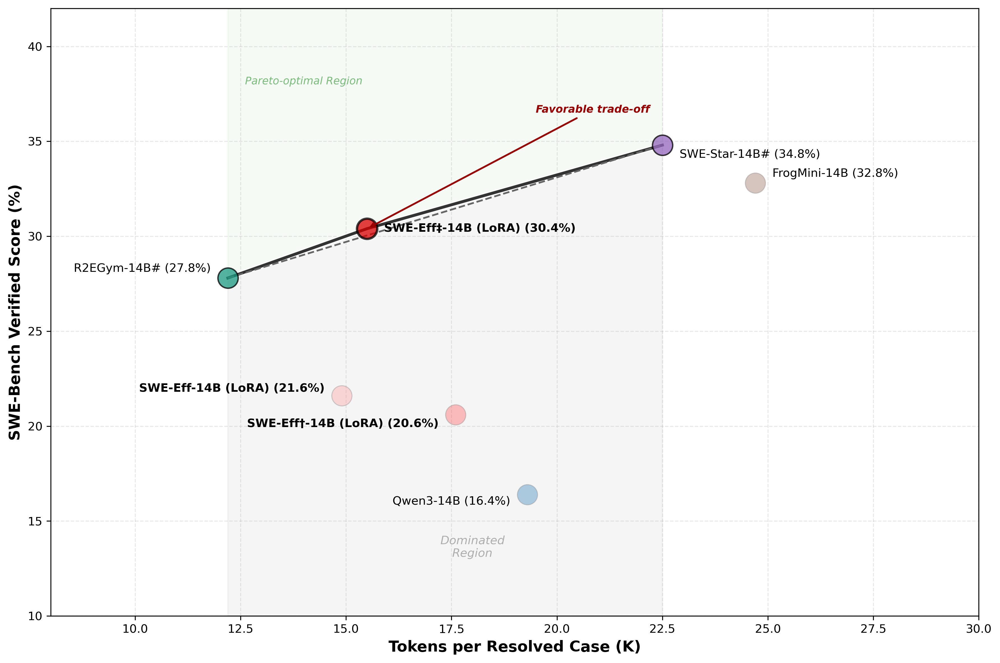

# Training Small Code Agent Models on Limited Resources

**Jianqing Zhang**, ...  
UbiCloud  

---

# Overview

Training effective SWE agent models demands **enormous compute and data**, resources inaccessible to most teams. Can competitive agents be built under **severely limited resources**?

  
**Figure 1:** **SWE-bench Verified score vs. training FLOPs.** SWE-Eff‡-14B achieves cost-competitive performance at a fraction of the training cost. The circle size means the training data amount.

We present **SWE-Eff**, a framework that trains SWE agent models under severely constrained resources (~3K trajectories, **LoRA on Qwen3-14B**, 32K context). Our approach combines three key techniques: (1) a multi-stage **data processing pipeline** that filters for behavioral efficiency, hallucination control, and thought–action alignment, yielding 3K high-quality trajectories from public data; (2) **suggestive thinking** with masked supervision, which injects reasoning prompts into training while masking them from loss via `mask_think`, designed to preserve the model's **autonomous reasoning** while implicitly guiding efficient agent behaviors; and (3) an **adaptive dual-model routing strategy** where an aggressive default (SWE-Eff) for structured tasks and a conservative substitute (SWE-Eff†) for hard problems are combined via adaptive routing (SWE-Eff‡), where each task is routed to the more suitable model based on task characteristics.

🔗 **Models:** [SWE-Eff](https://huggingface.co/ubicloud/SWE-Eff-14B) · [SWE-Eff†](https://huggingface.co/ubicloud/SWE-Eff-Hard-14B) | **Data:** [SWE-Eff-SFT-3K](https://huggingface.co/datasets/ubicloud/filtered-R2EGym-SFT-Trajectories)

# Background

Unlike standard instruction tuning, agent SFT learns from **multi-turn interaction trajectories** that include exploration, tool use, code edits, and execution feedback [1], making each sample far longer and more complex than isolated instruction-response pairs [2]. SWE agents further require repository understanding, iterative debugging, and long sequential workflows, demanding large context windows and extensive training data [3,4].

These requirements create a **resource dilemma**. Large models (32B+) with long contexts (128K tokens) cannot fit on a single GPU, even on an H200 (141GB), while multi-GPU servers remain difficult to access. Meanwhile, GPU supply constraints are expected to persist through at least 2027 [5], and large-scale datasets drive up both training time and rental costs. After several trials, we found that a **14B model with a 32K context window** can fit on a single H200 without offloading when using LoRA [6], making it accessible to teams with minimal GPU resources. We conduct training on 2× H200 GPUs for faster iteration, completing in approximately 10.5 hours.

This motivates a focus on **token efficiency**. More concise agent outputs reduce generated tokens and shorten subsequent context, lowering computation and memory costs across the entire trajectory, which benefits both training and deployment.

# Data Processing

To achieve token-efficient SFT under limited resources, several data-centric factors should be considered:

1. **Quality:** Solve the task within a limited context window.
2. **Behavior efficiency:** Avoid redundant searches, edits, and loops.
3. **Hallucination control:** Reduce unsupported guesses and unnecessary trials.
4. **Thought–action alignment:** Keep reasoning and actions consistent for smaller models.
5. **Deduplication:** Remove redundant samples to reduce training cost.

For **basic quality**, records must satisfy two hard constraints to be considered valid training data:

* **Completion:** `exit_status = Submitted`, indicating the agent generated and submitted a patch.
* **Correctness:** `resolved = True`, indicating the patch passed tests and resolved the target issue.

For **behavioral soundness**, we remove trajectories that are valid syntactically but exhibit inefficient problem-solving behaviors:

* **Redundant loop detection:** Consecutive tool calls are normalized (whitespace-collapsed and truncated to 100 characters). Trajectories are rejected if the same `(tool, command)` pair appears ≥3 times consecutively, capturing agents stuck in repetitive loops (e.g., repeatedly calling `ls` or `cat`).
* **Excessive search ratio:** If a trajectory contains >10 tool calls and over 60% are search-related (`search_file`, `search_content`, `search_dir`, `glob`, `find_file`, `list_dir`), it is rejected, identifying agents that explore excessively without taking actions.

For **hallucination control**, regex-based rules detect fabricated or unsupported reasoning:

* **Shortcut patterns:** Remove trajectories containing phrases such as directly editing without investigation, skipping necessary steps, assuming problems are solved, or making premature conclusions.
* **False reasoning:** Reject trajectories with repeated contradictions (e.g., claiming a file was found while simultaneously indicating it does not exist).

For **thought–action alignment**, we enforce consistency between stated intent and executed actions:

* Intent statements (e.g., *"I will..."*, *"Let me..."*) are extracted and compared with tool usage.
* Trajectories are rejected when edit intentions lead to search actions, or search intentions directly trigger editing actions, indicating inconsistency between reasoning and behavior.

We apply the above processing pipeline to an [**open-sourced** dataset](https://huggingface.co/datasets/R2E-Gym/R2EGym-SFT-Trajectories) and obtain 3K high-quality trajectories.

# Training with Suggestive Thinking

During our experiments, we found that an SFT model trained on limited resources could reliably solve easy and moderate tasks, but consistently struggled with harder problems. Therefore, we train a second complementary model specialized for hard problems, using **suggestive thinking** while maintaining token efficiency.

## Suggestive Thinking

The original agentic SFT dataset does not contain `<think></think>` blocks in assistant responses, whereas our base model, Qwen3-14B, is a reasoning model that naturally generates internal thinking content. Prior work suggests that explicit reasoning is important for improving the performance of smaller agent models [7]. Therefore, to train the second complementary model for harder tasks, we inject specialized thinking prompts into each assistant message to preserve the reasoning capability of the base model during SFT on the new dataset.

  
**Figure 2:** Suggestive thinking illustration.

Specifically, we prepend a `<think></think>` block containing suggestive guidance designed to repeatedly encourage desirable behaviors, such as:

* `<think> Let's think step by step ... </think>` (encourages deeper reasoning before taking actions)
* `<think> Let's view, think, edit, test ... </think>` (standardizes workflows and reduces arbitrary behavior)
* `<think> If I get stuck in a loop, I need to think of different solutions to break out of it. </think>` (mitigates repetitive action loops common in smaller agent models)

For difficult tasks, we encourage more deliberate reasoning and therefore use the first template by default. We also experimented with other thinking prompts and found them effective for their respective objectives.

However, directly training on injected thinking content causes the model to imitate these prompts verbatim rather than develop its own reasoning process. To address this, we introduce a `mask_think` mechanism that excludes the content inside `<think></think>` from loss computation while retaining supervision on the `<think>` and `</think>` tokens themselves. Under the teacher-forcing SFT setting, the model still observes the injected thinking prompts as part of its input context, but it is free to generate its own reasoning because no loss is applied to the internal thinking content. This allows the suggestive guidance to influence the model implicitly while preserving autonomous reasoning behavior.

## Training Recipe and Resources

We apply several adaptations for training on the relatively small SFT dataset (~3K trajectories). Specifically, we use LoRA with a low rank and relatively high dropout to improve parameter efficiency and reduce overfitting. Training is conducted on 2× H200 GPUs and completes in approximately 10.5 hours, resulting in relatively low training cost and hardware requirements.

Compared with standard agent SFT, our training introduces two key modifications:

* Injecting suggestive thinking prompts into the training data
* Enabling the `mask_think` mechanism to exclude think contents from the loss computation

The detailed training configuration is shown below:

**Table 1:** Training configurations.

| Item                     | Value                                                      |
| ------------------------ | ---------------------------------------------------------- |
| Base Model               | Qwen3-14B                                                  |
| Precision                | bfloat16                                                   |
| PEFT Method              | LoRA                                                       |
| LoRA Rank (r)            | 16                                                         |
| LoRA Alpha               | 32                                                         |
| LoRA Dropout             | 0.2                                                        |
| Adapter Size             | 246 MB                                                     |
| Global Batch Size        | 16                                                         |
| Gradient Accumulation    | 8                                                          |
| Micro Batch Size per GPU | 1                                                          |
| Learning Rate            | 2e-4                                                       |
| LR Scheduler             | Cosine                                                     |
| Warmup Ratio             | 0.05                                                       |
| Weight Decay             | 0.1                                                        |
| Gradient Checkpointing   | Enabled                                                    |
| Attention Backend        | Flash Attention 3                                          |
| Training Epochs          | 3                                                          |
| Total Training Time      | ~10.5 h                                                    |
| Average Step Time        | ~123–135 s/step                                            |
| Maximum Context Length   | 32,768 tokens                                              |

# Evaluation

After the above efficiency-oriented training, we evaluate on the [SWE-bench Verified](https://www.swebench.com/) benchmark using [R2E-Gym](https://github.com/agentica-project/rllm/tree/main/examples/agents/swe) as the agent scaffold, with a 32K context window, a 100-turn interaction limit, `temperature=0.6`, `top_p=0.95`, and function calling disabled. Evaluation runs on a remote Docker server with 100 parallel agent workers connected via persistent SSH.

## Resolved Rate

Considering training resources, training data scale, and issue resolution performance together, we present the following comparison figure. Most reported scores are re-evaluated under the R2E-Gym scaffold for fair comparison. For agents marked with `*`, we report their originally published scores evaluated using OpenHands as the scaffold. Although this introduces some inconsistency in evaluation settings, these results still provide useful reference points. We additionally mark models trained based on Qwen2.5-Coder with `#`. Notably, the base model of Devstral is not derived from Qwen, and is denoted by `?`.

  
**Figure 3:** **SWE-Bench Verified score vs. training FLOPs.** Default evaluation uses R2E-Gym. `*` indicates reported OpenHands scores, `#` denotes Qwen2.5-Coder-based models, and `?` denotes non-Qwen models (Devstral). Circle size represents training data scale. `L` is short for LoRA.

As shown in the figure above, increasing training resources generally leads to higher SWE-bench performance, but the gains gradually plateau as resource consumption grows. In other words, the return on investment (ROI) decreases with additional training compute.
Notably, when re-evaluated under the same R2E-Gym scaffold used in our experiments, SWE-Star-14B exhibits a substantial performance drop, whereas R2E-Gym-14B remains relatively stable. For SWE-Star-14B, the primary failure modes are an inability to locate and fix bugs within the 100-step limit and formatting errors that prevent successful patch submission.
In contrast, the SWE-Eff‡-14B is trained using parameter-efficient LoRA fine-tuning and requires only approximately **68%** and **6%** of the training FLOPs used by FrogMini-14B and SWE-Star-14B, respectively, while maintaining cost-competitive SWE-bench performance.

SWE-Eff and SWE-Eff† are complementary models: SWE-Eff is an aggressive default model for standard tasks, while SWE-Eff† is a more conservative variant designed for harder tasks requiring deeper multi-step actions. Both are built on the same Qwen3-14B base architecture. Combining the two through an adaptive routing strategy yields SWE-Eff‡, achieving a **30.4%** resolved rate and demonstrating strong complementarity between the models. 

**Table 2:** Comparison between SWE-Eff and SWE-Eff†. SWE-Eff† achieves stronger performance on harder tasks.

| Dimension | SWE-Eff (Default) | SWE-Eff† (Complementary Substitute) |
|-----------|:-----------------:|:-------------------------:|
| Resolved rate | 21.6% | 20.6% |
| Avg steps | 37.1 | 44.5 (+20%) |
| Submission success rate | 43.2% | **55.3%** |
| Edit success rate | 54.2% | **63.2%** |
| >80-step resolve rate | 2.0% (1/51) | **13.7% (7/51)** |

When to switch to SWE-Eff†? We adopt the following decision rules:

1. If the bug has a clear error trace and is localized to a single file, route to **SWE-Eff**, which performs better on structured repositories with faster and more aggressive submission behavior (69.4% of its exclusive wins require fewer steps).
2. Otherwise, if the bug involves multi-file logic, unclear root causes, or complex API interactions, route to **SWE-Eff†**, which achieves higher edit precision (63.2% vs. 54.2%) and performs more verification through bash execution (15.1 vs. 11.3 per case).
3. If the repository belongs to known hard projects such as `sympy`, `sphinx`, or `psf`, prefer **SWE-Eff†**, which outperforms SWE-Eff by +4.0%, +4.5%, and +12.5%, respectively.
4. If the repository is relatively structured, such as `django`, `scikit-learn`, or `xarray`, prefer **SWE-Eff**, which achieves stronger performance on these repositories.

## Token Efficiency

  
**Figure 4:** **SWE-Bench Verified score vs. tokens cost.** SWE-Eff‡-14B achieves a favorable trade-off between resolved rate and token cost.

By filtering the training data to retain concise and efficient trajectories, we obtain the token-efficient SWE-Eff series based on Qwen3-14B. The combined model, SWE-Eff‡-14B, preserves token efficiency close to that of SWE-Eff-14B while delivering a substantial improvement in issue resolution rate. Compared with R2E-Gym-14B and SWE-Star-14B, SWE-Eff‡-14B achieves a **more favorable trade-off between resolved rate and token cost**, making it a near Pareto-optimal solution. This means comparable bug-fixing performance can be achieved with fewer tokens, directly translating to lower inference cost and faster wall-clock time per task.

# Future Work

Although SWE-Eff demonstrates that effective SWE agents can be trained with limited data and affordable GPU resources, several opportunities remain. First, the current complementary-model framework relies on heuristic routing rules; future work could replace these with a lightweight router that dynamically selects the appropriate model based on task complexity and early trajectory signals. Second, suggestive thinking warrants further study, including automatically generated prompts, adaptive masking strategies, and task-aware reasoning guidance. More broadly, we believe that adaptive routing, higher-quality trajectories, and principled reasoning supervision can further improve the performance-efficiency trade-off of small open-source SWE agents, narrowing the gap with much larger proprietary systems.

# Conclusion

This report presents SWE-Eff, a compact and cost-efficient SWE agent trained on approximately 3K filtered trajectories using Qwen3-14B, LoRA fine-tuning, and a 32K-token context window. Data filtering plays a key role by retaining only submitted and resolved tasks while removing inefficient trajectories. SWE-Eff achieves a 21.6% resolve rate with 37.1 average steps, while a complementary substitute model significantly improves performance on harder tasks. Together, they reach 30.4% on SWE-bench Verified under R2E-Gym while keeping token usage close to the efficient default model. These results show that **effective SWE agents do not require massive compute budgets**, lowering the barrier for teams with limited resources to build functional code agent capabilities.

# References

[1] Yao, Shunyu, et al. "React: Synergizing reasoning and acting in language models." arXiv preprint arXiv:2210.03629 (2022).

[2] Wang, Yizhong, et al. "Self-instruct: Aligning language models with self-generated instructions." ACL, 2023.

[3] Jimenez, Carlos E., et al. "Swe-bench: Can language models resolve real-world github issues?." ICLR, 2024.

[4] Yang, John, et al. "Swe-agent: Agent-computer interfaces enable automated software engineering." NeurIPS, 2024.

[5] Data Center Dynamics. "Global Data Center Power Demand Set to Rise by 50% by 2027: Report." Data Center Dynamics, 2025, www.datacenterdynamics.com/en/news/global-data-center-power-demand-set-to-rise-by-50-by-2027-report/.

[6] Hu, Edward J., et al. "Lora: Low-rank adaptation of large language models." ICLR, 2022.

[7] Yang, Wenkai, et al. "Towards thinking-optimal scaling of test-time compute for llm reasoning." NeurIPS, 2025.
